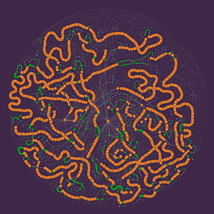

```{css, echo=FALSE}
.pagedjs_page:not(:first-of-type) {
  --sidebar-width: 0rem;
  --sidebar-background-color: #ffffff;
  --main-width: calc(var(--content-width) - var(--sidebar-width));
  --decorator-horizontal-margin: 0.2in;
}

[data-id="nodecorator"] {
  --decorator-border: none;
}
```


# Aside

{width="100%"}

Featured image: Style in synteny
mSystems 6(5):e00425-21, 2021

## Contact Info {#contact}

-   <i class="fa fa-envelope"></i> [@gmail.com](mailto:isabel.fernandez.escapa@gmail.com){.email}
-   <i class="fa fa-linkedin-square"></i> [Isabel Fernández Escapa](https://www.linkedin.com/in/isabel-fernández-escapa-4a086369)
-   <i class="fa fa-github"></i> [github.com/IsabelFE](https://github.com/IsabelFE)
-   <i class="fa fa-phone"></i> +1 617-416-8599

## Skills {#skills}

-   Bioinformatics, Data Analysis & Visualization

-   Illumina NGS Platforms and Sequencing Technologies

-   Infectious Diseases and Microbiome 

-   R, Linux/Unix, Nextflow, Git, AWS

-   Leadership, Mentorship, and Interdisciplinary Collaboration

## Disclaimer {#disclaimer}

This resume was made with the R package [pagedown](https://github.com/rstudio/pagedown).

Last updated on `r Sys.Date()`

# Main

## Isabel Fernández Escapa {#title}

### BIOINFORMATICS | GENOMICS | MICROBIOLOGY | BIOTECH

A microbiologist highly experienced in NGS applications and bioinformatics, with a deep knowledge of bacterial physiology and microbial communities. A proficient problem solver, capable of envisioning product solutions while working closely with laboratory scientists, product managers, software developers and senior leadership. 


## Professional Experience {data-icon="suitcase"}

### Associate Director, Bioinformatics

Pandemic Response Lab (PRL)

New York City, NY

Jun 2022

-   Provided subject matter expertise on the streamlining and automation of end to end NGS lab operations: sample accessioning, LIMS design, bioinformatic and QC analysis, report generation and data delivery.
-   Designed the architecture and supervised the development of a NextFlow based modular environment to fully automate all bioinformatic steps, including integration with in-house LIMS system, QC analysis, and data storage/delivery.
-   Supervised implementation of a QC bioinformatics pipeline to assist R&D efforts on the development of a hybrid capture oncological panel.
-   Supervised team operations for multiple workflows delivering data to customers within a tight schedule, including COVID-19 surveillance from both clinical and wastewater samples, RNA-seq, hybrid capture, whole-genome and plasmid sequencing.

### Principal Scientist, Bioinformatics

Pandemic Response Lab (PRL)

New York City, NY

Jul/2021 - Jun/2022

-   Single handedly designed, built and maintained a QC report generation workflow to assist operations on a high throughput sequencing production laboratory. 
-   Built and managed a team, provided training to perform routine analytical tasks, as well as mentorship and supervision to develop independent work.

### Senior Bioinformatics Scientist

Pandemic Response Lab (PRL)

New York City, NY

Apr/2021 - Jul/2021

-   Participated on developing and optimizing a SARS-CoV-2 amplicon sequencing bioinformatics workflow for NGS Illumina data.
-   Established a workflow for weekly submission of SARS-CoV-2 sequencing data to public repositories (GISAID and NCBI/SRA).

### Senior Staff Scientist, Bioinformatics

Baylor College of Medicine

Houston, TX

Sep/2019 - Apr/2021

-   Responsible for the design and implementation of bioinformatic pipelines to analyze data derived from microbe-microbe and host-microbe interactions in Human Nasal Organoids.
-   Established a workflow for exploring genomic diversity using Pangenomics & Phylogenomics (using PanACoTa, Anvio, PPanGGOLiN, GET_HOMOLOGUES, and GET_PHYLOMARKERS).
-   Managed the lab GitHub repositories and computing resources.
-   Mentored students and research assistants on bioinformatics and data analysis.

### Sequencing and Bioinformatics Core Director

The Forsyth Institute

Cambridge, MA

-   Developed and validated a comprehensive workflow for analysis of 16S rRNA gene tag sequencing data that uses a training set derived from the Expanded Human Oral Microbiome Database (eHOMD) in conjunction with high-resolution algorithms, to allow species-level identification of oral, nasal and skin bacteria.
-   Supervised improvements on the 16S rRNA gene V1-V3 microbiome NGS library preparation to achieve longer and more informative reads that, combined with the use of eHOMD, allowed an even higher percentage of species-level assignment. 
-   Managed the team of research associates and bioinformaticians on the day to day operations of the Core to serve internal and external clients (academic collaborations and commercial services).

Nov/2017 - Aug/2019


## Academic Appointments & Awards {data-icon="school"}

### Assistant Investigator

The Forsyth Institute

Cambridge, MA

Mar/2019 - Aug/2019

### Research Fellow

Harvard School of Dental Medicine, Department of Oral Medicine, Infection, and Immunity

Boston, MA

Nov/2012 - Aug/2019

### Post-Doctoral Fellow

The Forsyth Institute, Katherine P. Lemon Lab

Cambridge, MA

Nov/2012 - Nov/2017

- Harvard Catalyst Reactor Program Pilot Grant. Human Oral Microbiome Collaboration Opportunity. “Expanding the HOMD to Include Sinonasal- and Skin-associated Bacteria”. Role: Co-Investigator. Mar 2016 - Mar 2017.
- Ramón Areces Foundation Postdoctoral Fellowship. Oct 2013 - Oct 2015.

## Education & Fellowships {data-icon="graduation-cap" data-concise="true"}

### Ph.D., Biochemistry and Molecular Biology

Complutense University of Madrid / Center for Biological Research (CIB/CSIC)

Madrid, Spain

Sep/2006 - May/2012

**Thesis**: "Study of polyhydroxyalkanoates metabolism in *Pseudomonas putida*: Physiological implications and further applications in the development of functionalized bioplastics". Supervisor: Dra. María Auxiliadora Prieto.

- CSIC I3P Program Travel Fellowship at the Faculty of Biochemical and Chemical Engineering, TU Dortmund, Germany. Apr 2009 - July 2009.
- CSIC I3P Program Predoctoral Fellowship. Jan 2007 - Dec 2010.
- CSIC Research Introduction Program Fellowship. Sep 2006 - Dec 2006.


### B.Sc., Biology

University of León

León, Spain

Sep/2001 - Jun/2006

- Fellowship for Collaboration at the Biochemistry and Molecular Biology Department (Science and Education National Department). Sep 2005 - Jun 2006.
- CSIC Research Introduction Program Fellowship at the Agricultural Research Station (EAE-CSIC). Jul 2005 - Sep 2005.
- University of León Educative Cooperation Program Fellowship for an Internship at ANTIBIÓTICOS S.A.U. Industries. Jul 2004 - Sep 2004. 

## <br> {#nodecorator data-icon=NULL}


## Scientific publications {#nodecorator data-icon="newspaper"}

-   Michael J. Hammerling, Shinyoung Clair Kang, William Ward, **Escapa, I.F**, Pradeep Bugga, Cybill Del Castillo, Melissa Hopkins, Steven Chase, Sol Rey, Dylan Law, Alexander Carpio, Katharine Nelson, Simran Chhabria, Simran Gupta, Tiara Rivera, Jon M. Laurent, Haiping Hao, Henry H. Lee. (2022). Development and scaling of a sequencing pipeline for genomic surveillance of SARS-CoV-2 in New York City. medRxiv.   doi.org/10.1101/2022.05.25.22273991.
-   Flores Ramos, S., Brugger, S.D., **Escapa, I.F**, Skeete, C.A., Cotton S.L., Eslami, S.M., Gao, W., Bomar, L., Tran, T.H., Jones, D.S., Minot, S., Roberts, R.J., Johnston, C.D., Lemon, K.P (2021). Genomic Stability and Genetic Defense Systems in Dolosigranulum pigrum, a Candidate Beneficial Bacterium from the Human Microbiome. mSystems. Oct 26;6(5):e0042521.
-   Brugger, S.D., Eslami, S.M., Pettigrew, M.M., **Escapa, I.F**, Henke, M.M, Kong, Y., Lemon, K.P. (2020). Dolosigranulum pigrum cooperation and competition in human nasal microbiota. mSphere. Sep 9;5(5):e00852-20.
-   **Escapa, I.F**, Huang, Y., Chen, T., Lin, M., Kokaras, A., Dewhirst, F.E., Lemon, K.P. (2020) Construction of habitat-specific training sets to achieve species-level assignment in 16S rRNA gene datasets. Microbiome. 8, 65.
-   **Escapa, I.F**, Chen, T., Huang, Y., Gajare, P., Dewhirst, F.E., Lemon, K.P. (2018). New Insights into Human Nostril Microbiome from the Expanded Human Oral Microbiome Database (eHOMD): a Resource for the Microbiome of the Human Aerodigestive Tract. mSystems. Dec 4;3(6):e00187-18.
-   Wollenberg, M.S., Claesen, J., **Escapa, I.F**, Aldridge, K.L., Fischbach, M.A., Lemon, K.P. (2014). Propionibacterium-produced coproporphyrin III induces Staphylococcus aureus aggregation and biofilm formation. MBio. Jul 22;5(4):e01286-14.
-   Prieto, A., **Escapa, I.F**, Martínez, V., Dinjaski, N., Herencias, C., de la Peña, F., Tarazona, N., Revelles, O. (2014). A holistic view of polyhydroxyalkanoate metabolism in Pseudomonas putida. Environ. Microbiol. 18(2):341-57.
-   Follonier, S., **Escapa, I.F**, Fonseca, P.M., Henes, B., Panke, S., Zinn, M., Prieto, M.A. (2013). New insights on the reorganization of gene transcription in Pseudomonas putida KT2440 at elevated pressure. Microb Cell Fact. 12:30.
-   **Escapa, I.F**, del Cerro, C., García, J. L., and Prieto, M. A. (2013). The role of GlpR repressor in Pseudomonas putida KT2440 growth and PHA production from glycerol. Environ. Microbiol. 15(1):93-110.
-   Poblete-Castro, I., **Escapa, I.F**, Jäger, C., Puchalka, J., Lam, C. M. C., Schomburg, D., Prieto, M. A., and Martins dos Santos V.A.P. (2012). The metabolic response of P. putida KT2442 producing high levels of polyhydroxyalkanoate under singleand multiple-nutrient-limited growth: Highlights from a multi-level omics approach. Micro Cell Fac, 11:34.
-   **Escapa, I.F**, García, J. L., Bühler, B., Blank, L. M., and Prieto, M. A. (2012). The polyhydroxyalkanoate metabolism controls carbon and energy spillage in Pseudomonas putida. Environ. Microbiol. 14(4):1049-63.
-   **Escapa, I.F**, Morales, V., Martino, V. P., Pollet, E., Averous, L., García, J. L., and Prieto, M. A. (2011). Disruption of beta-oxidation pathway in Pseudomonas putida KT2442 to produce new functionalized PHAs with thioester groups. Appl. Microbiol. Biotechnol. 89(5):1583-1598.
-   Galán, B., Dinjaski, N., Maestro, B., de Eugenio, L. I., **Escapa, I.F**, Sanz, J. M., García, J. L., and Prieto, M. A. (2011). Nucleoid-associated PhaF phasin drives intracellular location and segregation of polyhydroxyalkanoate granules in Pseudomonas putida KT2442. Mol. Microbiol. 79:402-418.
-   de Eugenio, L. I., Galán, B., **Escapa, I.F**, Maestro, B., Sanz, J. M., García, J. L., and Prieto, M. A. (2010). The PhaD regulator controls the simultaneous expression of the pha genes involved in polyhydroxyalkanoate metabolism and turnover in Pseudomonas putida KT2442. Environ. Microbiol. 12:1591-1603.
-   de Eugenio, L. I., **Escapa, I.F**, Morales, V., Dinjaski, N., Galán, B., García, J. L., and Prieto, M. A. (2010). The turnover of medium-chain-length polyhydroxyalkanoates in Pseudomonas putida KT2442 and the fundamental role of PhaZ depolymerase for the metabolic balance. Environ. Microbiol. 12:207-221.

## Patents {#nodecorator data-icon="file"}

-   **Escapa, I.F**, del Cerro, C., García, J. L., and Prieto, M. A. "A system for the improvement of polyhydroxyalkanoates production (bioplastic) from glycerol in genetically modified Pseudomonas putida". Application number: P201131846, Spain, 16th November, 2011. Titular entity: Spanish National Research Council (CSIC). PCT international extension number: ES2012/070793.
-   **Escapa, I.F**, Morales V., García J.L., and Prieto M.A. "Synthesis of polyhydroxyalkanoates (PHA) with thioester groups in the side chain". Application number: P201031401, Spain, 21st September, 2010. Titular entity: Spanish National Research Council (CSIC). Patent licenses by Biopolis S.L. PCT international extension number: ES2011/070654.

## Invited talks {#nodecorator data-icon="award"}

-   Polymer Biotechnology Group. Biological Research Center, Madrid, Spain. "Beneficial Microbes: From Biotechnological Applications of PHAs to Microbiome-based Diagnostics and Therapeutics". May 2019.
-   Channing Network Science Seminar, Harvard Medical School, Boston, MA. "Achieving species-level resolution from 16S rRNA gene short-read data using a high-resolution training set with the RDP naïve Bayesian Classifier". Apr 2019.
-   Microbial Sciences Initiative Chalk Talk, Harvard University, Cambridge, MA. "When less is more: training to improve resolution in microbiome data analysis". Mar 2019.
-   Infectious Diseases Research Conference at Boston Children's Hospital, Harvard Medical School, Boston, MA. "Achieving species-level resolution in human aerodigestive microbiome 16S rRNA studies using the eHOMD high-resolution training set for the naïve Bayesian RDP Classifier". Dec 2018.
-   Infectious Diseases Research Conference at Boston Children's Hospital, Harvard Medical School, Boston, MA. "The expanded Human Oral Microbiome Database (eHOMD) facilitates species-level identification of human upper aerodigestive tract microbiome data". Feb 2018.

## Contributions to conferences {#nodecorator data-icon="users"}

-   Huang Y., **Escapa I.F.**, Chen T. Lin M., Kokaras A., Dewhirst F.E., Lemon K.P. Achieving species-level resolution from 16S rRNA gene short-read data using a high-resolution training set with the RDP naïve Bayesian Classifier. Poster. XXV Boston Bacterial Meeting, Boston (USA). Jun 2019.
-   **Escapa I.F.** eHOMD: an expanded database and a new microbiome analysis pipeline. Oral Communication. XVII Mark Wilson Conference, XXVIII Annual Meeting of the Oral Immunology/Microbiology Research Group Cancun (Mexico). Feb 2018.
-   **Escapa I.F.**, Wollenberg M.S., Aldridge K.L., Sivanathan V., Hochschild A., Lemon K.P. Role of Sbp in Staphylococcus aureus biofilm formation. Poster. XXII Boston Bacterial Meeting, Boston (USA). Jun 2016.
-   **Escapa I.F.**, Wollenberg M.S., Aldridge K.L., Lemon K.P. A newly identified extracellular protein involved in Staphylococcus aureus biofilm formation. Poster. XX Boston Bacterial Meeting, Boston (USA). Jun 2014.
-   **Escapa I.F.**, Wollenberg M.S., Aldridge K.L., Lemon K.P. A newly identified extracellular protein involved in Staphylococcus aureus biofilm formation. Poster. V American Society for Microbiology Conference on Beneficial Microbes, Washington DC (USA). Sep 2014.
-   Wollenberg M.S., Claesen J., **Escapa I.F**, Aldridge K.L., Fischbach M.A., Lemon K.P. Propionibacterium-produced extracellular coproporphyrin III induces Staphylococcus aureus aggregation and biofilm formation. V American Society for Microbiology Conference on Beneficial Microbes, Washington DC (USA). Sep 2014.
-   Morales V., **Escapa I.F.**, Prieto. M.A., Martino V., Pollet E. and Avérous L. Production and characterization of functionalized medium-chain-length polyhydroxyalkanoates containing thioester groups in the side chain. Poster. International Symposium on Biopolymers (ISBP2010), Stuttgart (Germany). Oct 2010.
-   **Escapa I.F.**, Morales V., Martino V., Pollet E., Avérous L., and Prieto. M.A. Engineering Pseudomonas putida KT2442 for the production of new functionalized polyhydroxyalkanoates containing thioester groups in the side chain. Oral Communication. BIOTEC2010, V International Meeting on Biotechnology, Pamplona (Spain). Sep-Oct 2010.
-   **Escapa I.F.**, Nogales J., Díaz E., García J.L., Bühler B., Blank L. M. and Prieto M.A. Influence of Polyhydroxyalkanoate Content on Central Carbon Metabolism Operation of Pseudomonas putida KT2442. Poster. Systems Biology of Microorganisms, Paris (France). Mar 2010.
-   de Eugenio L.I., **Escapa I.F.**, Morales V., Dinjaski N., Galán B., García J.L., and Prieto M.A. The PHA turnover allows carbon flux adaptations in Pseudomonas putida KT2442. Poster. European Symposium on Biopolymers (ESBP09), Madeira (Portugal). Nov 2009.
-   **Escapa I.F.**, Morales V., García J.L., and Prieto M.A. Production of functionalized polyhydroxyalkanoates by an alternative beta-oxidation pathway in Pseudomonas putida KT2442. Poster (Awarded as best poster communication). European Symposium on Biopolymers (ESBP09), Madeira (Portugal). Nov 2009.
-   de Eugenio L.I., **Escapa I.F.**, Morales V., Dinjaski N., Galán B., García J.L., and Prieto M.A. Redirecting polyhydroxyalkanoate metabolism balance towards the bioproduction of chiral intermediates in Pseudomonas putida KT2442. Poster. European congress on biotechnology (ECB14), Barcelona (Spain). Sep 2009.
-   Poblete Castro I., **Escapa I.F.**, Prieto M.A., Jäger C., Schomburg D., Puchalka J. and Martins dos Santos V.A.P. Título: "Omics" analysis of Medium-Chain-Length Poly-3-Hydroxyalkanoate synthesis in Pseudomonas putida KT2442 under different nutrient limitations. Poster. Pseudomonas 09, XII International Conference, Hannover (Germany). Aug 2009.
-   **Escapa I.F.**, de Eugenio L.I., Nogales J., Díaz E., García J.L. and Prieto M.A. A Systems Biology Approach for Studying the Polyhydroxyalkanoate Metabolism in Pseudomonas putida KT2442. Poster. Pseudomonas 09, XII International Conference, Hannover (Germany). Aug 2009.
-   **Escapa I.F.**, de Eugenio L.I., Galán B., García J.L. and Prieto M.A. New insights into polyhydroxyalkanoate metabolism regulation in Pseudomonas putida KT2442. Oral Communication. BIOTEC2008, IV International Meeting on Biotechnology, Granada (Spain). Sep 2008.
-   de Eugenio L.I., **Escapa I.F.**, Galán B., García J.L. and Prieto M.A. Polyhydroxyalkanoate Regulation: New Tools for Old Issues. Poster. European Symposium on Biopolymers (ESBP07), Kusadasi (Turkey). Oct 2007.

## Complementary training {#nodecorator data-icon="book"}

-   Strategies and Techniques for Analyzing Microbial Population Structures (Marine Biological Laboratory, University of Chicago). Woods Hole, Massachusetts (Aug 3-13, 2016).
-   Certificate in Applied Biostatistics (Harvard Catalyst's Postgraduate Program in Clinical and Translational Science, Harvard Medical School). Boston, Massachusetts (Sep 2013 - May 2014).
-   Kadner Institute for Graduate Students and Postdoctoral Scientists in Preparation for Careers in Microbiology (American Society for Microbiology). San Jose, California (Jul 27-31, 2013).

## Institutional Service {#nodecorator data-icon="calendar"}

-   Member of the Mentorship Task Force, Forsyth Institute (2019).
-   Member of the Committee on Pre and Postdoctoral Training, Forsyth Institute (2017-2019).
-   Member of the Task Force on Postdoctoral Training, Forsyth Institute (2016-2017).

## Teaching {#nodecorator data-icon="chalkboard-teacher"}

-   Co‐Instructor at Molecular Biotechnology BME62/162, CHBE62/162, Bio62. Tufts University, Medford, MA (Summer 2019).

## Editorial Activities {#nodecorator data-icon="pencil"}

-   Ad hoc reviewer: Microbiome, BMC Research Notes, Frontiers in Microbiology, mSphere, BDJOpen and MicrobiologyOpen.

## Professional Societies {#nodecorator data-icon="bookmark"}

-   Member of the American Society for Microbiology, ASM (2013--Present).
-   Member of the Spanish Society of Biotechnology, SEBIOT (2007-Present).


