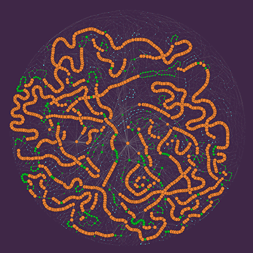

```{css, echo=FALSE}
.pagedjs_page:not(:first-of-type) {
  --sidebar-width: 0rem;
  --sidebar-background-color: #ffffff;
  --main-width: calc(var(--content-width) - var(--sidebar-width));
  --decorator-horizontal-margin: 0.2in;
}

.pagedjs_page:nth-of-type(1),
.pagedjs_page:nth-of-type(2) {
  --decorator-border: 1px solid #ccc;
}

.pagedjs_page:nth-of-type(n+3) {
  --decorator-border: 1px solid white;
}
```

# Aside

{width="100%"}

Featured image: Style in synteny mSystems 6(5):e00425-21, 2021

## Contact Info {#contact}

-   [isabel.fernandez.escapa\@gmail.com](mailto:isabel.fernandez.escapa@gmail.com){.email}
-   <i class="fa fa-linkedin-square"></i> [Isabel Fernández Escapa](https://www.linkedin.com/in/isabel-fernández-escapa-4a086369)
-   <i class="fa fa-github"></i> [github.com/IsabelFE](https://github.com/IsabelFE)
-   <i class="fa fa-github"></i> [github.com/KLemonLab](https://github.com/KLemonLab)
-   <i class="fa fa-phone"></i> +1 617-416-8599

## Skills {#skills}

-   Bioinformatics Pipeline Development (Nextflow, HPC, Cloud Computing)
-   Data Infrastructure (Git, FAIR data frameworks, reproducible systems)
-   NGS Platforms (Illumina, WGS, amplicon, hybrid capture, RNASeq)
-   Multi-Omics Analysis (RNASeq, pangenomics, metabolic enrichment)
-   Interactive Tool Development (R Shiny, interactive dashboards)
-   Data Analysis & Visualization 
-   Microbial Genomics & Microbiome
-   Leadership, Mentorship & Interdisciplinary Collaboration


# Main

## Isabel Fernández Escapa {#title}

### MICROBIOLOGY \| BIOINFORMATICS \| INFRASTRUCTURE 

Computational microbiologist with 15+ years of experience building reproducible workflows that accelerate discovery and make complex data accessible to interdisciplinary teams. I combine deep knowledge of bacterial physiology and microbial communities with a proven ability to design and deploy scalable bioinformatics systems. A proficient problem solver who bridges wet-lab science and computational engineering, capable of envisioning product solutions and driving them from concept to deployment while working closely with laboratory scientists, product managers, software developers, and senior leadership.


## Professional Experience {data-icon="briefcase"}

### Assistant Professor (K.P. Lemon Lab)

Baylor College of Medicine, MVM Dept.

Houston, TX

Jul/2024 - Present

-   Built an interactive Shiny app providing customizable access to complex RNASeq datasets empowering researchers without computational expertise to explore results independently.
-   Designed a Data Analysis and Laboratory Information Integrity Core for a multi-PI grant proposal, encompassing standardized pipelines for multi-omics, FAIR data management frameworks, and visualization dashboards across collaborative projects.
-   Contributed to all lab grant proposals as bioinformatics lead, providing preliminary analyses, visualizations, and methodological sections, as well as input on experimental design and overall scientific scope.

### Bioinformatics Manager (K.P. Lemon Lab)

Baylor College of Medicine, MVM Dept.

Houston, TX

May/2023 - Jun/2024

-   Architected a data management framework integrating code version control and data storage, with portable environment variable configurations enabling reproducible code execution across team members' systems.
-   Established bioinformatics workflows, including pangenomics, phylogenomics, metabolic predictions, and host-microbe dual RNASeq.
-   Mentored and supervised technicians and students in programming, data visualization, statistical modeling, and best documentation practices to ensure scientific rigor and reproducibility across all lab publications.


### Associate Director, Bioinformatics

Pandemic Response Lab (PRL)

New York City, NY

Jun/2022 - Feb/2023

-   Provided subject matter expertise on the streamlining and automation of end to end NGS lab operations: sample accessioning, LIMS design, bioinformatic and QC analysis, report generation and data delivery.
-   Designed the architecture and supervised the development of a NextFlow based modular environment to fully automate all bioinformatic steps, including integration with in-house LIMS system, QC analysis, and data storage/delivery.
-   Supervised implementation of a QC bioinformatics pipeline to assist R&D efforts on the development of a hybrid capture oncological panel.
-   Supervised team operations for multiple workflows delivering data to customers within a tight schedule, including COVID-19 surveillance from both clinical and wastewater samples, RNA-seq, hybrid capture, whole-genome and plasmid sequencing.

### Principal Scientist, Bioinformatics

Pandemic Response Lab (PRL)

New York City, NY

Jul/2021 - Jun/2022

-   Single handedly designed, built and maintained a dashboard for NGS QC report generation to assist operations on a high throughput sequencing production laboratory.
-   Built and managed a team, provided training to perform routine analytical tasks, as well as mentorship and supervision to develop independent work.


### Senior Bioinformatics Scientist

Pandemic Response Lab (PRL)

New York City, NY

Apr/2021 - Jul/2021

-   Participated on developing and optimizing a SARS-CoV-2 amplicon sequencing bioinformatics workflow for NGS Illumina data.
-   Established a workflow for weekly submission of SARS-CoV-2 sequencing data to public repositories (GISAID and NCBI/SRA).

### Senior Staff Scientist, Bioinformatics

Baylor College of Medicine, MVM Dept.

Houston, TX

Sep/2019 - Apr/2021

-   Established a workflow for exploring genomic diversity using Pangenomics & Phylogenomics (using PanACoTa, Anvio, PPanGGOLiN, GET_HOMOLOGUES, and GET_PHYLOMARKERS).
-   Assisted in the design of bioinformatic pipelines to analyze data derived from microbe-microbe and host-microbe interactions in Human Nasal Organoids.
-   Managed the lab GitHub repositories and computing resources.
-   Mentored students and research assistants on bioinformatics and data analysis.

### Sequencing and Bioinformatics Core Director / Assistant Investigator

The Forsyth Institute

Cambridge, MA

Nov/2017 - Aug/2019

-   Developed and validated a comprehensive workflow for analysis of 16S rRNA gene tag sequencing data that uses a training set derived from the Expanded Human Oral Microbiome Database (eHOMD) in conjunction with high-resolution algorithms, to allow species-level identification of oral, nasal and skin bacteria.
-   Supervised improvements on the 16S rRNA gene V1-V3 microbiome NGS library preparation to achieve longer and more informative reads that, combined with the use of eHOMD, allowed an even higher percentage of species-level assignment.
-   Managed the team of research associates and bioinformaticians on the day to day operations of the Core to serve internal and external clients (academic collaborations and commercial services).

### Research / Post-Doctoral Fellow (K.P. Lemon Lab)

The Forsyth Institute / Harvard School of Dental Medicine

Cambridge, MA

Nov/2012 - Nov/2017

-   Investigated small-molecule-mediated interactions between *Cutibacterium* spp. and *Staphylococcus aureus*, studying their impact on *S. aureus* biofilm formation and aggregation behavior.
-   Led the expansion of the Human Oral Microbiome Database (eHOMD) and its high-resolution RDP classifier training set to encompass bacteria from the entire human aerodigestive/respiratory tract.


## Education {data-icon="graduation-cap"}

### Ph.D., Biochemistry and Molecular Biology

Complutense University of Madrid / Center for Biological Research (CIB/CSIC)

Madrid, Spain

Sep/2006 - May/2012

-   **Thesis Title**: "Study of polyhydroxyalkanoates metabolism in *Pseudomonas putida*: Physiological implications and further applications in the development of functionalized bioplastics". Supervisor: Dra. María Auxiliadora Prieto.
-   Applied bacterial genetics, metabolic engineering, and early multi-omics approaches to study polyhydroxyalkanoate biosynthesis in *P. putida*, developing industrial applications for microbially-produced bioplastics.


### B.Sc., Biology

University of León

León, Spain

Sep/2001 - Jun/2006


## Grants, Fellowships & Awards {data-icon="award"}

-   Harvard Catalyst Reactor Program Pilot Grant. Human Oral Microbiome Collaboration Opportunity. “Expanding the HOMD to Include Sinonasal- and Skin-associated Bacteria”. **Role: Co-Investigator**. Mar 2016 - Mar 2017.
-   Ramón Areces Foundation Postdoctoral Fellowship. Oct 2013 - Oct 2015.
-   CSIC I3P Program Travel Fellowship at the Faculty of Biochemical and Chemical Engineering, TU Dortmund, Germany. Apr 2009 - July 2009.
-   CSIC I3P Program Predoctoral Fellowship. Jan 2007 - Dec 2010.
-   CSIC Research Introduction Program Fellowship. Sep 2006 - Dec 2006.
-   Science & Education National Department Undergrad Fellowship. Sep 2005 - Jun 2006.
-   CSIC Research Introduction Program Fellowship at the Agricultural Research Station (EAE-CSIC). Jul 2005 - Sep 2005.
-   University of León Educative Cooperation Program Fellowship for an Internship at ANTIBIÓTICOS S.A.U. Industries. Jul 2004 - Sep 2004.


## Scientific publications {data-icon="file-text"}

-   Boyd, A. I., Quintanilla, K. A., **Escapa, I. F.**, Lewis, M. A., Kafer, L. A., Zeng, X. L., Blutt, S. E., Ibberson, C. B., & Lemon, K. P. (2026). D-alanine aminotransferase (Dat) promotes *Staphylococcus aureus* colonization fitness on human nasal respiratory epithelium. Preprint. bioRxiv. 2026.06.01.729472. 
-   Kafer, L. A., **Escapa, I. F.**, Boyd, A. I., Tostado, A. R., Kambal, A., Blutt, S. E., Avadhanula, V., Piedra, P. A., and Lemon, K. P. (2026). *Streptococcus pneumoniae* colonization modulates human nasal epithelial responses to respiratory syncytial virus infection. Preprint. bioRxiv. 2026.02.05.703985.
-   Boyd, A. I., Kafer, L. A., **Escapa, I. F.**, Kambal, A., Tariq, H., Hilsenbeck, S. G., Nguyen-Phuc, H., Rajan, A., Lensmire, J. M., Patras, K. A., Piedra, P.A., Blutt, S. E., and Lemon, K. P. (2025). Nasal microbionts differentially colonize and elicit cytokines in human nasal epithelial organoids. mSphere. Oct 29;10(10):e0049325.
-   Popowitch, E. B., Tran, T. H., **Escapa, I. F.**, Bhatt, E., Sozat, A. K., Ahmed, N., Deming, C., Roberts, A. Q., Segre, J. A., Kong, H. H., Conlan, S., Lemon, K.P., and Kelly, M.S. (2024). Description of two novel *Corynebacterium* species isolated from human nasal passages and skin. Preprint. bioRxiv. 2024.11.21.624533.
-   Tran, T. H., **Escapa, I. F.**, Roberts, A. Q., Gao, W., Obawemimo, A. C., Segre, J. A., Kong, H. H., Conlan, S., Kelly, M. S., and Lemon, K. P. (2024). Metabolic capabilities are highly conserved among human nasal-associated *Corynebacterium* species in pangenomic analyses. mSystems. Dec 17;9(12):e0113224.
-   Hammerling, M. J., Kang, S. C., Ward, W., **Escapa, I. F.**, Bugga, P., Del Castillo, C., Hopkins, M., Chase, S., Rey, S., Law, D., Carpio, A., Nelson, K., Chhabria, S., Gupta, S., Rivera, T., Laurent, J.M., Hao, H., and Lee, H.H. (2022). Development and scaling of a sequencing pipeline for genomic surveillance of SARS-CoV-2 in New York City. Preprint medRxiv. 2022.05.25.22273991.
-   Flores Ramos, S., Brugger, S.D., **Escapa, I. F.**, Skeete, C.A., Cotton S.L., Eslami, S.M., Gao, W., Bomar, L., Tran, T.H., Jones, D.S., Minot, S., Roberts, R.J., Johnston, C.D., and Lemon, K.P (2021). Genomic stability and genetic defense systems in *Dolosigranulum pigrum*, a candidate beneficial bacterium from the human microbiome. mSystems. Oct 26;6(5):e0042521.
-   Brugger, S.D., Eslami, S.M., Pettigrew, M.M., **Escapa, I. F.**, Henke, M. M., Kong, Y., and Lemon, K.P. (2020). *Dolosigranulum pigrum* cooperation and competition in human nasal microbiota. mSphere. Sep 9;5(5):e00852-20.
-   **Escapa, I. F.**, Huang, Y., Chen, T., Lin, M., Kokaras, A., Dewhirst, F. E., and Lemon, K.P. (2020) Construction of habitat-specific training sets to achieve species-level assignment in 16S rRNA gene datasets. Microbiome. 8, 65.
-   **Escapa, I. F.**, Chen, T., Huang, Y., Gajare, P., Dewhirst, F. E., and Lemon, K.P. (2018). New insights into human nostril microbiome from the Expanded Human Oral Microbiome Database (eHOMD): a resource for the microbiome of the human aerodigestive tract. mSystems. Dec 4;3(6):e00187-18.
-   Wollenberg, M. S., Claesen, J., **Escapa, I. F.**, Aldridge, K.L., Fischbach, M. A., and Lemon, K.P. (2014). *Propionibacterium*-produced coproporphyrin III induces *Staphylococcus aureus* aggregation and biofilm formation. MBio. Jul 22;5(4):e01286-14.
-   Prieto, A., **Escapa, I. F.**, Martínez, V., Dinjaski, N., Herencias, C., de la Peña, F., Tarazona, and N., Revelles, O. (2014). A holistic view of polyhydroxyalkanoate metabolism in *Pseudomonas putida*. Environ. Microbiol. 18(2):341-57.
-   Follonier, S., **Escapa, I. F.**, Fonseca, P.M., Henes, B., Panke, S., Zinn, M., and Prieto, M. A. (2013). New insights on the reorganization of gene transcription in *Pseudomonas putida* KT2440 at elevated pressure. Microb Cell Fact. 12:30.
-   **Escapa, I. F.**, del Cerro, C., García, J. L., and Prieto, M. A. (2013). The role of GlpR repressor in *Pseudomonas putida* KT2440 growth and PHA production from glycerol. Environ. Microbiol. 15(1):93-110.
-   Poblete-Castro, I., **Escapa, I. F.**, Jäger, C., Puchalka, J., Lam, C. M. C., Schomburg, D., Prieto, M. A., and Martins dos Santos V.A.P. (2012). The metabolic response of *P. putida* KT2442 producing high levels of polyhydroxyalkanoate under singleand multiple-nutrient-limited growth: Highlights from a multi-level omics approach. Micro Cell Fac, 11:34.
-   **Escapa, I. F.**, García, J. L., Bühler, B., Blank, L. M., and Prieto, M. A. (2012). The polyhydroxyalkanoate metabolism controls carbon and energy spillage in *Pseudomonas putida*. Environ. Microbiol. 14(4):1049-63.
-   **Escapa, I. F.**, Morales, V., Martino, V. P., Pollet, E., Averous, L., García, J. L., and Prieto, M. A. (2011). Disruption of beta-oxidation pathway in *Pseudomonas putida* KT2442 to produce new functionalized PHAs with thioester groups. Appl. Microbiol. Biotechnol. 89(5):1583-1598.
-   Galán, B., Dinjaski, N., Maestro, B., de Eugenio, L. I., **Escapa, I. F.**, Sanz, J. M., García, J. L., and Prieto, M. A. (2011). Nucleoid-associated PhaF phasin drives intracellular location and segregation of polyhydroxyalkanoate granules in *P. putida* KT2442. Mol. Microbiol. 79:402-418.
-   de Eugenio, L. I., Galán, B., **Escapa, I. F.**, Maestro, B., Sanz, J. M., García, J. L., and Prieto, M. A. (2010). The PhaD regulator controls the simultaneous expression of the pha genes involved in polyhydroxyalkanoate metabolism and turnover in *Pseudomonas putida* KT2442. Environ. Microbiol. 12:1591-1603.
-   de Eugenio, L. I., **Escapa, I. F.**, Morales, V., Dinjaski, N., Galán, B., García, J. L., and Prieto, M. A. (2010). The turnover of medium-chain-length polyhydroxyalkanoates in *Pseudomonas putida* KT2442 and the fundamental role of PhaZ depolymerase for the metabolic balance. Environ. Microbiol. 12:207-221.

## Patents {data-icon="lightbulb"}

-   Huang, Y., **Escapa, I. F.**, Lemon, K. P., and Dewhirst, F. E. “System and Method for achieving high gene data resolution using training sets.”. Titular entity: The Forsyth Institute. Priority Data: 62/775,997, 06.12.2018, US. International Application No: PCT/US2019/053634.
-   **Escapa, I. F.**, del Cerro, C., García, J. L., and Prieto, M. A. "A system for the improvement of polyhydroxyalkanoates production (bioplastic) from glycerol in genetically modified *Pseudomonas putida*". Application number: P201131846, Spain, 16th November, 2011. Titular entity: Spanish National Research Council (CSIC). PCT international extension number: ES2012/070793.
-   **Escapa, I. F.**, Morales V., García J. L., and Prieto M. A. "Synthesis of polyhydroxyalkanoates (PHA) with thioester groups in the side chain". Application number: P201031401, Spain, 21st September, 2010. Titular entity: Spanish National Research Council (CSIC). Patent licenses by Biopolis S.L. PCT international extension number: ES2011/070654.

## Invited talks {data-icon="microphone"}

-   Polymer Biotechnology Group. Biological Research Center, Madrid, Spain. "Beneficial Microbes: From Biotechnological Applications of PHAs to Microbiome-based Diagnostics and Therapeutics". May 2019.
-   Channing Network Science Seminar, Harvard Medical School, Boston, MA. "Achieving species-level resolution from 16S rRNA gene short-read data using a high-resolution training set with the RDP naïve Bayesian Classifier". Apr 2019.
-   Microbial Sciences Initiative Chalk Talk, Harvard University, Cambridge, MA. "When less is more: training to improve resolution in microbiome data analysis". Mar 2019.
-   Infectious Diseases Research Conference at Boston Children's Hospital, Harvard Medical School, Boston, MA. "Achieving species-level resolution in human aerodigestive microbiome 16S rRNA studies using the eHOMD high-resolution training set for the naïve Bayesian RDP Classifier". Dec 2018.
-   Infectious Diseases Research Conference at Boston Children's Hospital, Harvard Medical School, Boston, MA. "The expanded Human Oral Microbiome Database (eHOMD) facilitates species-level identification of human upper aerodigestive tract microbiome data". Feb 2018.

## Contributions to conferences {data-icon="users"}

-   Tran TH, **Escapa I. F.**, Roberts A. Q., Gao W., Obawemimo A. C., Segre J. A., Kong H. H., Conlan S., Kelly M. S., Lemon K. P. Pangenomic Insights into the Conserved Metabolic Capabilities of Human Nasal *Corynebacterium* Species. 2024 Cold Spring Harbor Laboratory Microbiome Meeting, NY.
-   Huang Y., **Escapa I. F.**, Chen T. Lin M., Kokaras A., Dewhirst F. E., Lemon K. P. Achieving species-level resolution from 16S rRNA gene short-read data using a high-resolution training set with the RDP naïve Bayesian Classifier. XXV Boston Bacterial Meeting, Boston (USA). Jun 2019.
-   **Escapa I. F.** eHOMD: an expanded database and a new microbiome analysis pipeline. XVII Mark Wilson Conference, XXVIII Annual Meeting of the Oral Immunology/Microbiology Research Group Cancun (Mexico). Feb 2018. **Oral Presentation**.
-   **Escapa I. F.**, Wollenberg M. S., Aldridge K. L., Sivanathan V., Hochschild A., Lemon K. P. Role of Sbp in *Staphylococcus aureus* biofilm formation. XXII Boston Bacterial Meeting, Boston (USA). Jun 2016.
-   **Escapa I. F.**, Wollenberg M. S., Aldridge K. L., Lemon K. P. A newly identified extracellular protein involved in *Staphylococcus aureus* biofilm formation. XX Boston Bacterial Meeting, Boston (USA). Jun 2014.
-   **Escapa I. F.**, Wollenberg M. S., Aldridge K. L., Lemon K. P. A newly identified extracellular protein involved in *Staphylococcus aureus* biofilm formation.  V ASM Conference on Beneficial Microbes, Washington DC (USA). Sep 2014.
-   Wollenberg M.S., Claesen J., **Escapa I. F.**, Aldridge K.L., Fischbach M. A., Lemon K.P. Propionibacterium-produced extracellular coproporphyrin III induces *Staphylococcus aureus* aggregation and biofilm formation. V ASM Conference on Beneficial Microbes, Washington DC (USA). Sep 2014.
-   Morales V., **Escapa I. F.**, Prieto. M. A., Martino V., Pollet E. and Avérous L. Production and characterization of functionalized medium-chain-length polyhydroxyalkanoates containing thioester groups in the side chain. International Symposium on Biopolymers (ISBP2010), Stuttgart (Germany). Oct 2010.
-   **Escapa I. F.**, Morales V., Martino V., Pollet E., Avérous L., and Prieto. M. A. Engineering *Pseudomonas putida* KT2442 for the production of new functionalized polyhydroxyalkanoates containing thioester groups in the side chain. BIOTEC2010, V International Meeting on Biotechnology, Pamplona (Spain). Sep-Oct 2010. **Oral Presentation**.
-   **Escapa I. F.**, Nogales J., Díaz E., García J. L., Bühler B., Blank L. M. and Prieto M. A. Influence of Polyhydroxyalkanoate Content on Central Carbon Metabolism Operation of *Pseudomonas putida* KT2442. Systems Biology of Microorganisms, Paris (France). Mar 2010.
-   de Eugenio L. I., **Escapa I. F.**, Morales V., Dinjaski N., Galán B., García J. L., and Prieto M. A. The PHA turnover allows carbon flux adaptations in *Pseudomonas putida* KT2442. European Symposium on Biopolymers (ESBP09), Madeira (Portugal). Nov 2009.
-   **Escapa I. F.**, Morales V., García J. L., and Prieto M. A. Production of functionalized polyhydroxyalkanoates by an alternative beta-oxidation pathway in *Pseudomonas putida* KT2442. European Symposium on Biopolymers (ESBP09), Madeira (Portugal). Nov 2009. **Best poster award**.
-   de Eugenio L. I., **Escapa I. F.**, Morales V., Dinjaski N., Galán B., García J. L., and Prieto M. A. Redirecting polyhydroxyalkanoate metabolism balance towards the bioproduction of chiral intermediates in *Pseudomonas putida* KT2442. European congress on biotechnology (ECB14), Barcelona (Spain). Sep 2009.
-   Poblete Castro I., **Escapa I. F.**, Prieto M. A., Jäger C., Schomburg D., Puchalka J. and Martins dos Santos V.A.P. Título: "Omics" analysis of Medium-Chain-Length Poly-3-Hydroxyalkanoate synthesis in *Pseudomonas putida* KT2442 under different nutrient limitations. Poster. Pseudomonas 09, XII International Conference, Hannover (Germany). Aug 2009.
-   **Escapa I. F.**, de Eugenio L. I., Nogales J., Díaz E., García J. L. and Prieto M. A. A Systems Biology Approach for Studying the Polyhydroxyalkanoate Metabolism in *Pseudomonas putida* KT2442. Pseudomonas 09, XII International Conference, Hannover (Germany). Aug 2009.
-   **Escapa I. F.**, de Eugenio L. I., Galán B., García J. L. and Prieto M. A. New insights into polyhydroxyalkanoate metabolism regulation in *Pseudomonas putida* KT2442. BIOTEC2008, IV International Meeting on Biotechnology, Granada (Spain). Sep 2008. **Oral Presentation**.
-   de Eugenio L. I., **Escapa I. F.**, Galán B., García J. L. and Prieto M. A. Polyhydroxyalkanoate Regulation: New Tools for Old Issues. European Symposium on Biopolymers (ESBP07), Kusadasi (Turkey). Oct 2007.

## Complementary training {data-icon="book"}

-   Strategies and Techniques for Analyzing Microbial Population Structures (Marine Biological Laboratory, University of Chicago). Woods Hole, Massachusetts (Aug 3-13, 2016).
-   Certificate in Applied Biostatistics (Harvard Catalyst's Postgraduate Program in Clinical and Translational Science, Harvard Medical School). Boston, Massachusetts (Sep 2013 - May 2014).
-   Kadner Institute for Grad Students and Postdocs in Preparation for Careers in Microbiology (ASM). San Jose, California (Jul 27-31, 2013).

## Institutional Service {data-icon="university"}

-   Member of the Mentorship Task Force, Forsyth Institute (2019).
-   Member of the Committee on Pre and Postdoctoral Training, Forsyth Institute (2017-2019).
-   Member of the Task Force on Postdoctoral Training, Forsyth Institute (2016-2017).

## Teaching {data-icon="chalkboard-teacher"}

-   Co‐Instructor at Molecular Biotechnology BME62/162, CHBE62/162, Bio62. Tufts University, Medford, MA (Summer 2019).

## Editorial Activities {data-icon="edit"}

-   Ad hoc reviewer for Cell Reports, Nucleic Acids Research Genomics and Bioinformatics, Microbiome, Frontiers in Microbiology, mSphere, mSystems, Antimicrobial Agents and Chemotherapy, American Journal of Respiratory Cell and Molecular Biology, Applied and Environmental Microbiology, MicrobiologyOpen, British Dental Journal Open, International Society for Microbial Ecology, and BMC Research Notes.

## Professional Societies {data-icon="globe"}

-   Member of the American Society for Microbiology, ASM (2013--Present).
-   Member of the Spanish Society of Biotechnology, SEBIOT (2007-Present).
